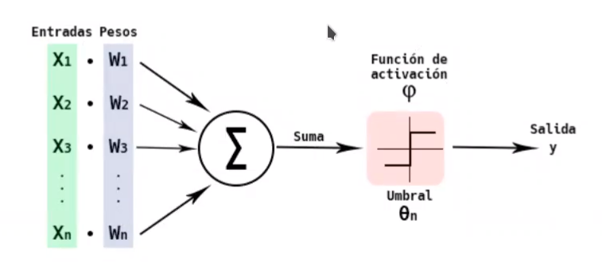
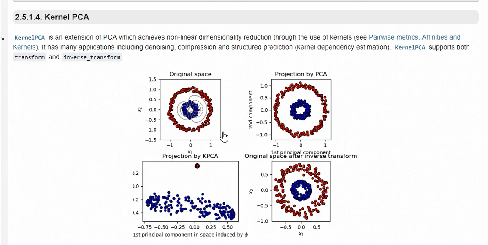

# Linkedin - python para scientist avanzado
[course](https://www.linkedin.com/learning/python-para-data-scientist-avanzado/data-scientist-con-python?resume=false)

# internal and external validation
  
  
# validation types
  

# internal validation
use all data to train

# external validation
keep some data to evaluate
- more resource because you need to evaluate and train several times


## External validation : random
split in train and test
```python
from sklearn.model_selection import train_test_split
import pandas as pd
from sklearn import linear_model
from sklearn.metrics import r2_score
df = pd.read_csv("base_datos_2008.csv", nrows=100_000)
df = df.dropna(subset = ["ArrDelay"])
df = df.sample(frac=1)

X = df[["AirTime", "Distance", "DepDelay"]]
Y = df["ArrDelay"]

x_train, x_test, y_train, y_test = train_test_split(X, Y, random_state=10, test_size=0.2)

model_regression_internal = linear_model.LinearRegression()
model_regression_internal.fit(X,Y)
internal_predictions = model_regression_internal.predict(X)
internal_r2_score = r2_score(Y, internal_predictions)
print(f"R2 with internal: {internal_r2_score}")

model_regression_external = linear_model.LinearRegression()
model_regression_external.fit(x_train,y_train)
external_predictions = model_regression_external.predict(x_test)
external_r2_score = r2_score(y_test, external_predictions)
print(f"R2 with external: {external_r2_score}")
```
### conclusions
- when there is few data and you apply internal validation, you will get overfitting 

- when data get's bigger you increase the R2, splitting the set in train and test, and reducing the overfitting, because the model will be able to predict new data, which is not close to the previous one
## External validation : random - problem
- the prediction depends of the random set selected

- if you shuffle again, the final prediction could change

## External validation : cross validation : kfold
  
1. for train use (1,2,3) for test use(4)
2. for train use (1,2,4) for test use(3)
3. for train use (2,3,4) for test use(1)
4. for train use (1,3,4) for test use(2)

## External validation  : Kfold
  
1. split data in k partitions
2. for i in k
3. take k-1 partitions for train, and k partitions for test
4. calculate $ R^2 $ for each iteration and then calculate the mean
> call, fit model several times, sk support it ;)
```python
import pandas as pd
import numpy as np
from sklearn.model_selection import KFold
from sklearn import linear_model
from sklearn.metrics import r2_score

df = pd.read_csv("base_datos_2008.csv", nrows=100_000)
df = df.dropna(subset = ["ArrDelay"])
df = df.sample(frac=1)

df = df.reset_index()

X = df[["AirTime", "Distance", "DepDelay"]]
Y = df["ArrDelay"]

model_regression_internal = linear_model.LinearRegression()

kf  = KFold(n_splits=10, shuffle = True)
partitions = kf.split(X)
results = []
for train_index, test_index in partitions:
   x_train, x_test = X.loc[train_index,], X.loc[test_index,]
   y_train, y_test = Y[train_index], Y[test_index]
   model_regression_internal.fit(x_train,y_train)
   predictions = model_regression_internal.predict(x_test)
   print("R2", r2_score(y_test, predictions))
   results.append(r2_score(y_test, predictions))

print(f"R2 average: {np.mean(results)}")
```

## External validation  : Leave One Out
- kfold with n partitions
- you need to reset the index
- useful for low data volume
```python
import warnings
warnings.filterwarnings('ignore')
import pandas as pd
import numpy as np
from sklearn.model_selection import LeaveOneOut
from sklearn import linear_model
from sklearn.metrics import r2_score

df = pd.read_csv("base_datos_2008.csv", nrows=10_000)
df = df.dropna(subset = ["ArrDelay"])
df = df.sample(frac=1)

df = df.reset_index()

X = df[["AirTime", "Distance", "DepDelay"]]
Y = df["ArrDelay"]

model_regression_internal = linear_model.LinearRegression()

loo = LeaveOneOut()

results = []
i = 0
for train_index, test_index in loo.split(X):
   x_train, x_test = X.loc[train_index,], X.loc[test_index,]
   y_train, y_test = Y[train_index], Y[test_index]
   print(f"{i}:", end="")
   model_regression_internal.fit(x_train,y_train)
   predictions = model_regression_internal.predict(x_test)
   print("Error : ",(y_test-predictions[0])**2)
   i+=1

```
# R2
- how close are the estimated values compare to the real values
- (0,1)
  

  
  
  


# R2 y overfitting
- when maximize R2 is the main goal
   - the bad side of this is the overfitting

# Neural networks
  
imitates human neuron
- requires hight processing power
- let you work different type of data

# Neural networks : concepts : parts
  

# Perceptron
  

# Neural network - Link
data pipe between two perceptrons

# Activation function
  

# Learning types

# Neural networks:  pros and cons
✅ good prediction
✅ support parallelization
❌ black box
❌ requires hight processing power

  

# Neural networks: code
```python
from sklearn.neural_network import MLPRegressor
from sklearn.neural_network import MLPClassifier
from sklearn.preprocessing import StandardScaler
from sklearn.model_selection import train_test_split
from sklearn.metrics import r2_score
import pandas as pd
df = pd.read_csv("base_datos_2008.csv", nrows=1_000_000)
df = df.dropna(subset=["AirTime", "Distance", "TaxiIn", "TaxiOut", "DepDelay", "ArrDelay"])
df = df.sample(frac=1)
X = df[["AirTime", "Distance", "TaxiIn", "TaxiOut", "DepDelay"]]
Y = df["ArrDelay"]
X_train, X_test, Y_train, Y_test = train_test_split(X, Y, test_size=0.2, random_state=1)
scaler = StandardScaler()
scaler.fit(X_train)

x_train = scaler.transform(X_train)
x_test = scaler.transform(X_test)

clf = MLPRegressor(hidden_layer_sizes=(5,), solver='adam', alpha=1e-5, random_state=1)

model = clf.fit(x_train, Y_train)

predictions = model.predict(X_test)
print("R2", r2_score(Y_test, predictions))
```

# MLPRegressor
- warm_start, learn from previous execution


# Training loss
function we want to minimize
  

# Regularization
penalty to add then the function is too complex, this is for avoid complex models and overfit
  

# GBoost and classification trees
better predictions
- assign values to each leaf in each tree to improve the final result

```python
from xgboost import XGBRegressor
from sklearn.preprocessing import StandardScaler
from sklearn.model_selection import train_test_split
from sklearn.metrics import r2_score
import pandas as pd
df = pd.read_csv("base_datos_2008.csv", nrows=1_000_000)

df = df.dropna(subset = ["ArrDelay"])
df = df.sample(frac=1).head(10000)

X = df[["AirTime", "Distance", "TaxiIn", "TaxiOut", "DepDelay"]]
Y = df["ArrDelay"]

X_train, X_test, Y_train, Y_test = train_test_split(X, Y, test_size=0.2, random_state=1)

scaler = StandardScaler()
scaler.fit(X_train)

X_train = scaler.transform(X_train)
X_test = scaler.transform(X_test)

model = XGBRegressor(learning_rate=0.5, max_depth=2, colsample_bytree=1, verbosity = 2, subsample=1, n_estimators=500)
model.fit(X_train, Y_train)

predictions = model.predict(X_test)
print("R cuadrado : ", r2_score(Y_test, predictions))
```

# Variable selection : by one
keep the most important variables for the model
```python
from sklearn import linear_model
import statsmodels.api as sm
import pandas as pd

df = pd.read_csv("base_datos_2008.csv", nrows=1_000_000)
df = df.dropna(subset = ["AirTime", "Distance", "TaxiIn", "TaxiOut", "DayOfWeek","DayofMonth", "Month", "DepDelay", "WeatherDelay"])
df = df.sample(frac=1).head(10000)

X = df[["AirTime", "Distance", "TaxiIn", "TaxiOut", "DayOfWeek","DayofMonth", "Month", "DepDelay", "WeatherDelay"]]

Y = df["ArrDelay"]

regr = linear_model.LinearRegression()
regr.fit(X,Y)
predicciones = regr.predict(X)

X2 = sm.add_constant(X)
est = sm.OLS(Y, X2)
est2 = est.fit()
print(est2.summary())
```
- removing DayOfWeek
```python
from sklearn import linear_model
import statsmodels.api as sm
import pandas as pd

df = pd.read_csv("base_datos_2008.csv", nrows=1_000_000)
df = df.dropna(subset = ["AirTime", "Distance", "TaxiIn", "TaxiOut", "DayofMonth", "Month", "DepDelay", "WeatherDelay"])
df = df.sample(frac=1).head(10000)

X = df[["AirTime", "Distance", "TaxiIn", "TaxiOut", "DayofMonth", "Month", "DepDelay", "WeatherDelay"]]

Y = df["ArrDelay"]

regr = linear_model.LinearRegression()
regr.fit(X,Y)
predicciones = regr.predict(X)

X2 = sm.add_constant(X)
est = sm.OLS(Y, X2)
est2 = est.fit()
print(est2.summary())
```
- you need to remove one by one, because each time you remove a variable all coefficients change

# variable selection RFE
recursive feature elimination
```python
from sklearn.feature_selection import RFE
import statsmodels.api as sm
import pandas as pd

df = pd.read_csv("base_datos_2008.csv", nrows=1_000_000)
df = df.dropna(subset = ["AirTime", "Distance", "TaxiIn", "TaxiOut", "DayofMonth", "Month", "DepDelay", "WeatherDelay"])
df = df.sample(frac=1).head(10000)

X = df[["AirTime", "Distance", "TaxiIn", "TaxiOut", "DayofMonth", "Month", "DepDelay", "WeatherDelay"]]

Y = df["ArrDelay"]

regr = linear_model.LinearRegression()
selector = RFE(estimator = regr, n_features_to_select = 2 )
selector.fit(X,Y)
print(selector.ranking_)
X.columns[selector.support_]
```


# param selection neural network : manual
- select the best alpha, solver y layer

```python
from sklearn.preprocessing import StandardScaler
from sklearn.model_selection import train_test_split
from sklearn.metrics import r2_score
import pandas as pd
from sklearn.neural_network import MLPRegressor
df = pd.read_csv("base_datos_2008.csv", nrows=1_000_000)
df = df.dropna(subset = ["AirTime", "Distance", "TaxiIn", "TaxiOut", "DepDelay"])
 df = df.sample(frac=1).head(1000)

X = df[["AirTime", "Distance", "TaxiIn", "TaxiOut", "DepDelay"]]
Y = df["ArrDelay"]

X_train, X_test, Y_train, Y_test = train_test_split(X, Y, test_size=0.2, random_state=1)

scaler = StandardScaler()
scaler.fit(X_train)

x_train = scaler.transform(X_train)
x_test = scaler.transform(X_test)

alphas = [0.0001, 0.001, 0.01, 0.1]
layers =  [5,10,50,1000]
solvers = ["lbfgs", "adam"]

for alpha in alphas:
   for layer in layers:
      for solver in solvers:
         clf = MLPRegressor(alpha = alpha, solver=solver, hidden_layer_sizes=(layer,), warm_start=True, max_iter=10000)
         model = clf.fit(X_train, Y_train)
         predictions = model.predict(X_test)
         print("R cuadrado : ", r2_score(Y_test, predictions), "Solver : ", solver, "layers, ", layer, "alpha : ", alpha)

```

# param selection neural network : automatically
```python
from sklearn.model_selection import GridSearchCV
from sklearn.model_selection import train_test_split
from sklearn.preprocessing import StandardScaler
from sklearn.neural_network import MLPRegressor
from sklearn.metrics import r2_score
import pandas as pd

df = pd.read_csv("base_datos_2008.csv", nrows=1_000_000)
df = df.dropna(subset = ["AirTime", "Distance", "TaxiIn", "TaxiOut", "DepDelay"])
 df = df.sample(frac=1).head(1000)

X = df[["AirTime", "Distance", "TaxiIn", "TaxiOut", "DepDelay"]]
Y = df["ArrDelay"]

X_train, X_test, Y_train, Y_test = train_test_split(X, Y, test_size=0.2, random_state=1)

scaler = StandardScaler()
scaler.fit(X_train)

x_train = scaler.transform(X_train)
x_test = scaler.transform(X_test)

params = {
   "alpha": [0.0001, 0.001, 0.01, 0.1],
   "hidden_layer_sizes": [2,5,10,50,100],
   "solver":("lbfgs", "adam"),
   "learning_rate": ("constant", "adaptive")
}

nn = MLPRegressor(warm_start=True, max_iter = 100_000)
clf = GridSearchCV(nn, params, cv=5, n_jobs=-1)
clf.fit(X, Y)

print(clf.best_params_)
```


# variable selection PCA (principal component analysis)
- when you have to much columns to make some visual and get some insight
- principal component analysis could make it simple for you
- you need to scale, because the whole method is base on variance
```python
from sklearn.decomposition import PCA
from sklearn.preprocessing import StandardScaler
import pandas as pd
import numpy as np
import matplotlib.pyplot as plt

df = pd.read_csv("base_datos_2008.csv", nrows=1_000_000)
df = df.dropna(subset = ["AirTime", "Distance", "TaxiIn", "TaxiOut", "DayofMonth", "Month", "DepDelay", "WeatherDelay"])
df = df.sample(frac=1).head(10000)

X = df[["AirTime", "Distance", "TaxiIn", "TaxiOut", "DayofMonth", "Month", "DepDelay", "WeatherDelay"]]

Y = df["ArrDelay"]

scaler = StandardScaler()
scaler.fit(X)

X = scaler.transform(X)

pca = PCA(n_components = 2)
pca.fit(X)
pca.components_
print(np.round(pca.components_))
print(pca.explained_variance_ratio_)

nuevos_valores = pca.transform(X)
plt.scatter(nuevos_valores[:,0], nuevos_valores[:,1])
plt.show()
```

  
  
# Incremental PCA
useful for big data

# Kernel PCA
useful when database is not linear
  

# Sparse PCA
- useful when there is a sparse matrix
- to many zeros
- netflix example
   - most of the people have not seen yet th movie

# data imputation
```python
from sklearn.impute import SimpleImputer
from sklearn import linear_model
import numpy as np
import pandas as pd
import matplotlib.pyplot as plt

df = pd.read_csv("base_datos_2008.csv", nrows=1_000_000)
df = df.sample(frac=1).head()
X = df[["AirTime", "Distance", "TaxiIn", "TaxiOut", "DepDelay", "ArrDelay", "CarrierDelay"]]

imp = SimpleImputer(missing_values = np.nan, strategy="mean")
imp.fit(X)
X2 = imp.fit_transform(X)
X2 = pd.DataFrame(X2)

X2.corr()
```
- reduce the variance
   - this is not good for the model

# imputation: correlation: correlation between the missing values and the other values
create a linear regression model base on other variables, the fact to do this is using the correlation

# text mining
- social network
- volume information
- quality information

# good text mining analysis
- should be scalable

# process
1. get the information
2. bag of words (text to word matrix)
3. reduce noise
   - lemmatization
   - stop words
   - stemming
4. analysis
5. model

# basic nltk
```python
import matplotlib.pyplot as plt
import nltk
import string

nltk.download("punkt")
nltk.download("stopwords")
from nltk.tokenize import sent_tokenize, word_tokenize
from nltk.probability import FreqDist
from nltk.corpus import stopwords
from wordcloud import WordCloud, STOPWORDS, ImageColorGenerator

text = open("snow_white.txt", "r").read()
wordcloud = WordCloud(max_font_size=50, max_words=100, background_color="white").generate(text)
plt.figure() 
plt.imshow(wordcloud, interpolation="bilinear")
plt.axis("off")
plt.show() 
```

# nltk : most common words
```python
import matplotlib.pyplot as plt
import nltk
import string

nltk.download("punkt")
nltk.download("stopwords")
from nltk.tokenize import sent_tokenize, word_tokenize
from nltk.probability import FreqDist
from nltk.corpus import stopwords
text = open("snow_white.txt", "r").read()
phrases = sent_tokenize(text)
words = word_tokenize(text)
fdist = FreqDist(words)
print(fdist.most_common(20))
```

# nltk : most common words : removing stop words
# stop word 
- word which add no meaning to the text
   - conjunction
   - prepositions
- stopwords brings all the stop words in several languages
- you should pick the specific language (spanish, english)

```python
import matplotlib.pyplot as plt
import nltk
import string

nltk.download("punkt")
nltk.download("stopwords")
from nltk.tokenize import sent_tokenize, word_tokenize
from nltk.probability import FreqDist
from nltk.corpus import stopwords
text = open("snow_white.txt", "r").read()
phrases = sent_tokenize(text)
words = word_tokenize(text)
# stop_words  = stopwords.words()
# stop_words  = stopwords.words("spanish")
stop_words  = stopwords.words("english")
stop_words += list(string.punctuation)

words = [word for word in words if word not in stop_words]
fdist = FreqDist(words)
print(fdist.most_common(30))
```

# nltk Stemming
- keep just the root of each word
- useful for apply standard to the text
```python
from nltk.stem import SnowballStemmer
from nltk.tokenize import sent_tokenize, word_tokenize
import matplotlib.pyplot as plt
import nltk
import string
from nltk.probability import FreqDist
from nltk.corpus import stopwords

nltk.download("punkt")
nltk.download("stopwords")

text = open("snow_white.txt", "r").read()
phrases = sent_tokenize(text)
words = word_tokenize(text)
# stop_words  = stopwords.words()
# stop_words  = stopwords.words("spanish")
stop_words  = stopwords.words("english")
stop_words += list(string.punctuation)

words = [word for word in words if word not in stop_words]

stemmer = SnowballStemmer("english")
roots = [stemmer.stem(word) for word in words]

fdist = FreqDist(roots)
print(fdist.most_common(30))
```


# nltk Lemmatizer
have in mind the position of the word in the phrase
```python
from nltk.stem import SnowballStemmer
from nltk.stem.wordnet import WordNetLemmatizer
from nltk.tokenize import sent_tokenize, word_tokenize
import matplotlib.pyplot as plt
import nltk
import string
from nltk.probability import FreqDist
from nltk.corpus import stopwords

nltk.download("punkt")
nltk.download("stopwords")
nltk.download("averaged_perceptron_tagger")
nltk.download("wordnet")
nltk.download("omw-1.4")

text = open("snow_white.txt", "r").read()
phrases = sent_tokenize(text)
words = word_tokenize(text)
# stop_words  = stopwords.words()
# stop_words  = stopwords.words("spanish")
stop_words  = stopwords.words("english")
stop_words += list(string.punctuation)

words = [word for word in words if word not in stop_words]

stemmer = SnowballStemmer("english")
lem = WordNetLemmatizer()

print(stemmer.stem("run"))

print(lem.lemmatize("running", "n")) #running as a name
print(lem.lemmatize("running", "v")) #running as a verb
nltk.pos_tag(words)
from nltk.corpus import wordnet
def get_wordnet_pos(word):
   tag = nltk.pos_tag([word])[0][1][0].upper()
   tag_dict = {"J": wordnet.ADJ,
               "N": wordnet.NOUN,
               "V": wordnet.VERB,
               "R": wordnet.ADV}
   return tag_dict.get(tag, wordnet.NOUN)

phrases = nltk.sent_tokenize(text)
phrases

for phrase in phrases:
   for word in nltk.word_tokenize(phrase):
      print(lem.lemmatize(word, get_wordnet_pos(word)))
```

# google translator : detect language
```python
from deep_translator import GoogleTranslator
translated = GoogleTranslator(source='auto', target='es').translate("keep it up, you are awesome") 
translated
```

# nltk : sentiment analysis
```python
from sklearn.feature_extraction.text import CountVectorizer
from nltk.tokenize import RegexpTokenizer
import pandas as pd
list1 = ["Bueno", "Malo", "Malo", "Malo", "Bueno", "Bueno", "Malo", "Bueno", "Bueno", "Malo"]
list2 = ["Lo recomendaria a todos mis amigos", "Es el peor producto que he comprado nunca", 
"Ni loco compraria este producto",
"No se lo recomendaria ni a mi enemigo", 
"Es un buen producto, si que lo recomendaria",
"me ha encantado",
"es una basura absoluta, ni me moleste en lavarlo, lo tire directamente",
"el enemigo publico numero uno de la suciedad",
"es un producto genial, se lo recomendaria a todos los compradores",
"hay que estar loco para comprar esta basura"]

df = pd.DataFrame({"Sentimiento": list1, "Valoracion": list2})
token =  RegexpTokenizer(r"[a-zA-Z0-9]+")
cv = CountVectorizer(lowercase=True, ngram_range = (1, 2),tokenizer=token.tokenize)
text_counts = cv.fit_transform(df["Valoracion"])
text_counts
print(text_counts)
from sklearn.model_selection import train_test_split
X_train, X_test, y_train, y_test = train_test_split(text_counts, df["Sentimiento"], test_size=0.5, random_state=42)

from sklearn.naive_bayes import MultinomialNB
from sklearn import metrics

clf = MultinomialNB().fit(X_train, y_train)
predicted = clf.predict(X_test)
print("MultinomialNB accuracy : ",metrics.accuracy_score(y_test, predicted))
y_test
predicted
```

# gensim
```python
import gensim
import nltk
import pandas as pd
from nltk.stem import SnowballStemmer
from nltk.tokenize import sent_tokenize, word_tokenize
from nltk import sent_tokenize, word_tokenize
from gensim import corpora, models

text = open("snow_white.txt", "r").read()
phrases = sent_tokenize(text)
phrases  = pd.DataFrame({"Frases": phrases})
stemmer = SnowballStemmer("english")

def preproceso(texto):
   results = []
   for token in gensim.utils.simple_preprocess(texto):
      if token not in gensim.parsing.preprocessing.STOPWORDS and len(token) > 3:
         results.append(stemmer.stem(token))
   return results

process_phrases  = phrases["Frases"].map(preproceso)
process_phrases
dictionary  = gensim.corpora.Dictionary(process_phrases)
dictionary.filter_extremes(no_below=15, no_above=0.5, keep_n=100000)
corpus = [dictionary.doc2bow(text) for text in process_phrases]
corpus
tfidf  =models.TfidfModel(corpus)
corpus_tfidf = tfidf[corpus]
# lda_model = gensim.models.LdaMulticore(corpus, num_topics=10, id2word=dictionary, passes=5, workers=2)
lda_model = gensim.models.LdaMulticore(corpus_tfidf, num_topics=10, id2word=dictionary, passes=5, workers=2)
for idx, topic in lda_model.print_topics(-1):
   print('Topic: {} \nWords: {}'.format(idx, topic))

```

# web scrapping
# bs4

```python
from bs4 import BeautifulSoup
import requests
response = requests.get("https://espanol.yahoo.com/")
soup = BeautifulSoup(response.content, "html.parser")
soup.find_all("a")
```

# bs4 sample wikipedia
```python
from bs4 import BeautifulSoup
import requests
page = requests.get("https://es.wikipedia.org/wiki/Python")
soup = BeautifulSoup(page.content, "html.parser")
print(soup.prettify())
print(soup.children)
soup.title
soup.title.parent
for child in soup.title.children:
   print(child)

soup.a
soup.find_all("a")
soup.find_all("p")
```

# bs4 get child, get links
```python
from bs4 import BeautifulSoup
import requests
page = requests.get("https://es.wikipedia.org/wiki/Python")
soup = BeautifulSoup(page.content, "html.parser")
links = soup.find(id="Enlaces_externos")
links.find_next()
links.find_next().find_next().contents
links = soup.findAll("div", {"class":"listaref"})
links

for d in soup.find("div", attrs={"class":"listaref"}).descendants:
   if d.name == "span" and d.get("class", "") == ["reference-text"]:
      print(d.text)

data = soup.find("div", attrs={"class":"listaref"})
for div in data:
   links = div.findAll("a")
   for a in links:
      if a["href"].startswith("http"):
         print(a["href"])


```

# bs4 get text
```python
from bs4 import BeautifulSoup
import requests
page = requests.get("https://es.wikipedia.org/wiki/Python")
soup = BeautifulSoup(page.content, "html.parser")
print(soup.get_text())
print(soup.title.string)
print(soup.get_text())

soup.body.find_all("p")

import re
def clean_html(html):
   expression = re.compile("<.*?>")
   text = re.sub(expression, "", html)
   return text

for elem in soup.body.find_all("p"):
   print(clean_html(str(elem)))

```

# bs4 get non textual information
```python
from bs4 import BeautifulSoup
import requests
page = requests.get("https://es.wikipedia.org/wiki/Python")
soup = BeautifulSoup(page.content, "html.parser")
for link in soup.findAll("a", attrs={"href": re.compile("^http://")}):
   print(link.get("href"))

baselink = "https://es.wikipedia.org"

for link in soup.findAll("a"):
   if str(link.get("href"))[0] == "/":
      print(baselink + link.get("href"))

baselink = "https://es.wikipedia.org"

for link in soup.findAll("a"):
   if str(link.get("href"))[0] == "/" and str(link.get("href"))[1] != "/":
      print(baselink + link.get("href"))

```
